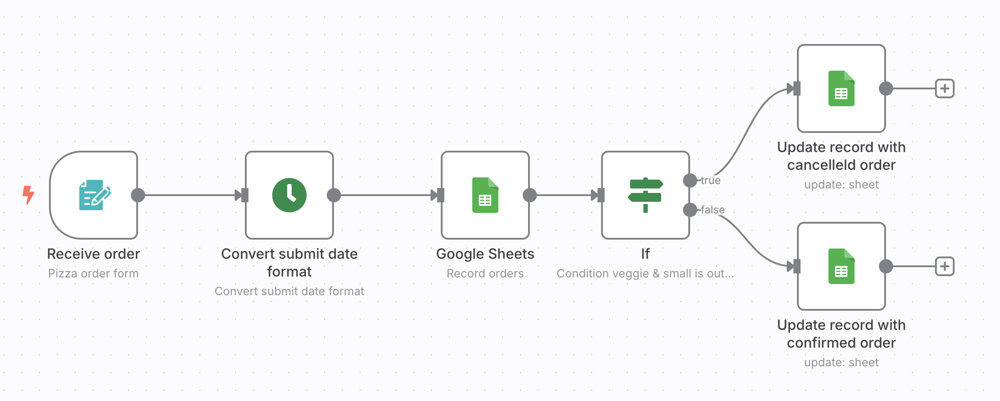

# My n8n

This repository contains an N8N workflow that listens to Google Forms submissions and sends the form data to a Google Sheets document.

## How to start

### Start n8n with docker

```bash
docker compose up -d
```

Then go to <http://localhost:5678>

### Create credentials

- Google Service Account
- Gemini API token

### Create the workflows

- Create from scratch
- Create from import json file (you use json from [workflows folder](./workflows))

## Example

### 01 pizza orders



### 02 LLM sentiment webhook


### 03 LLM sentiment form submission


