# My n8n

This repository contains an N8N workflow.

## How to start

### Start n8n with docker

```bash
docker compose up -d
```

Then go to <http://localhost:5678>

### Create credentials

- Google Service Account API key
- Google Drive OAuth Key
- Gemini API key
- Ollama
- Pinecone API key
- OpenAI API key
- Postgres

### Create the workflows

- Create from scratch
- Create from import json file (you use json from [workflows folder](./workflows))

## Example workflows

### 01 pizza orders

Order form submission then send order to Google Sheets

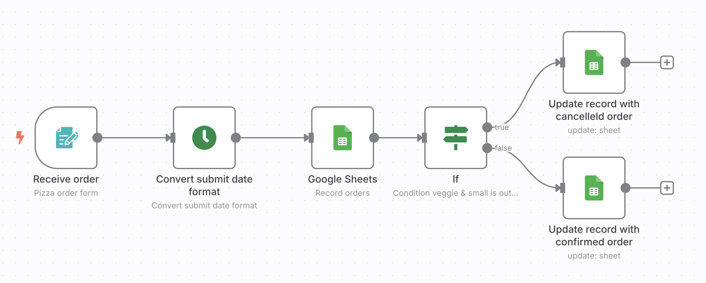
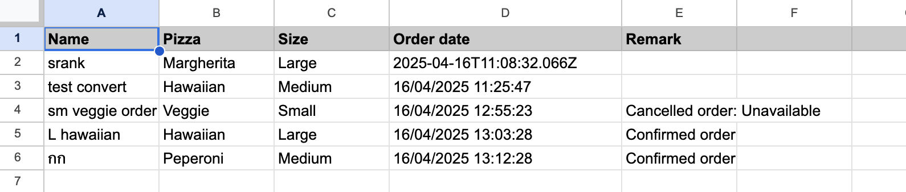

### 02 LLM sentiment webhook

Restful sent the review for return sentiment

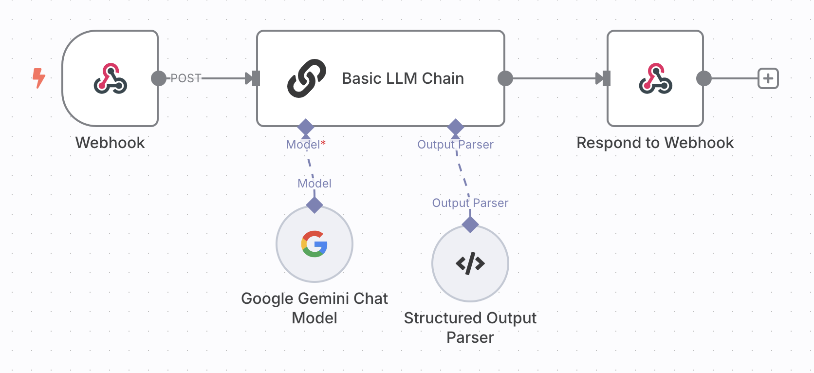

### 03 LLM sentiment form submission

Review form submission then keep sentiment to database

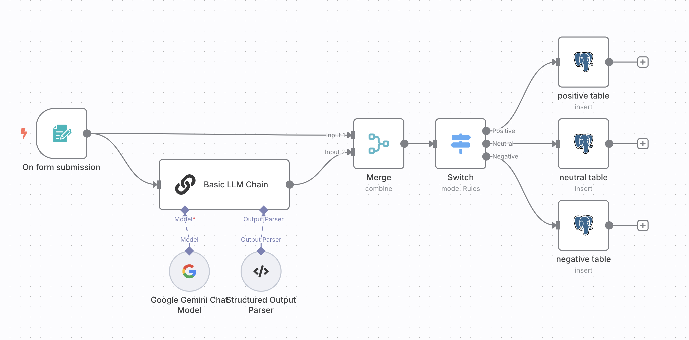

### 04 Updated Google drive as RAG

When added file to Google drive, update to Pinecone vector store automatically

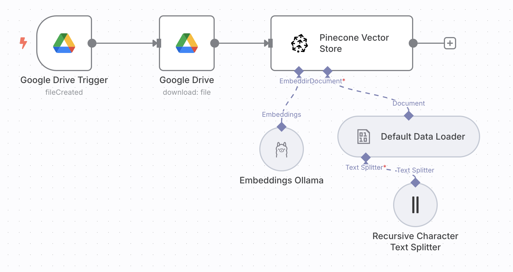

### 05 Restaurant chatbot

Restaurant chatbot assistant for provide information to user, embeded in website

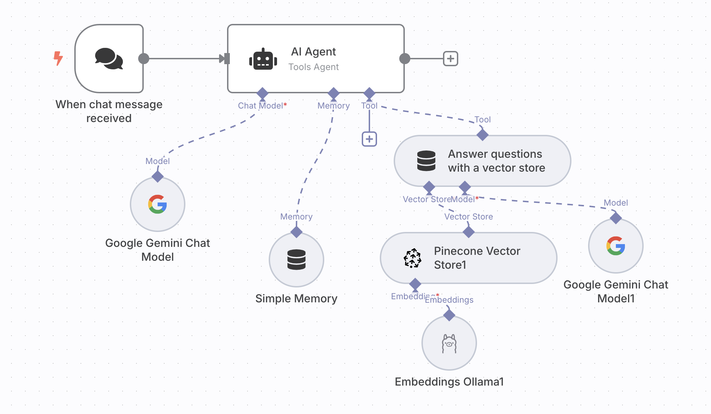
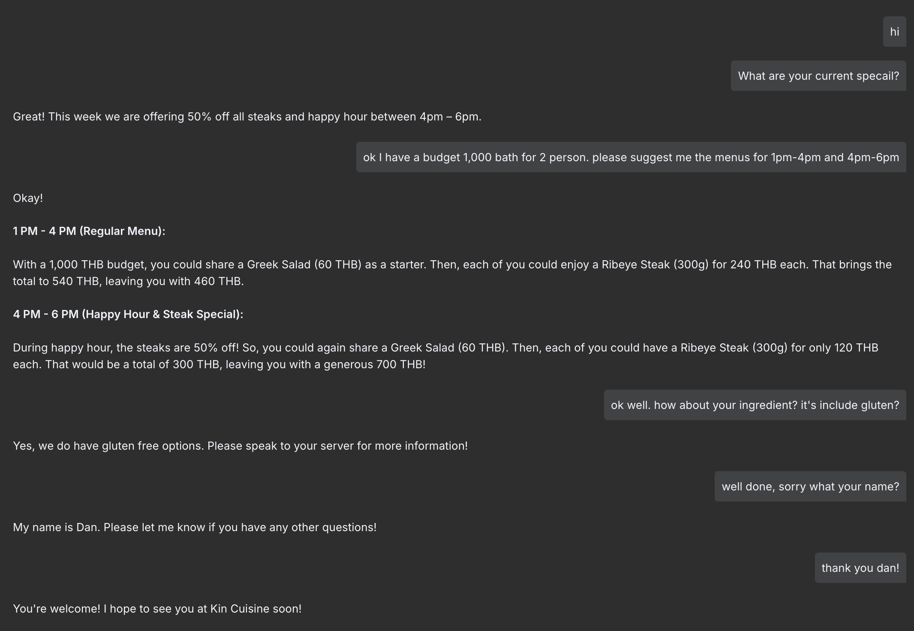

### 06 auto draft to reply email

Auto draft to reply email when received email about sponsorship opportunity

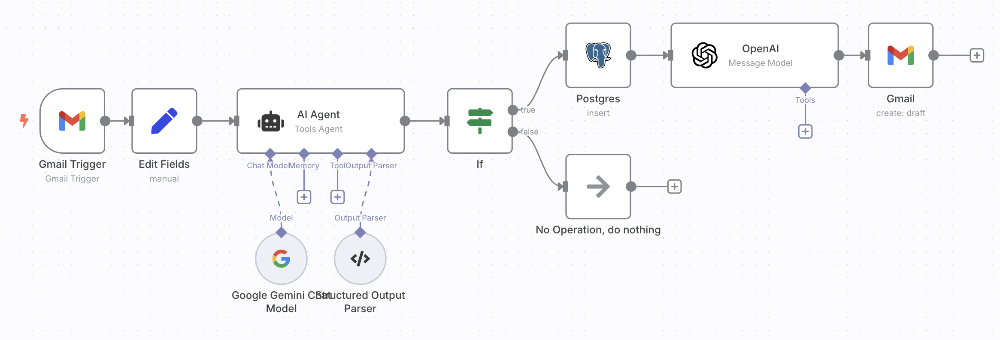
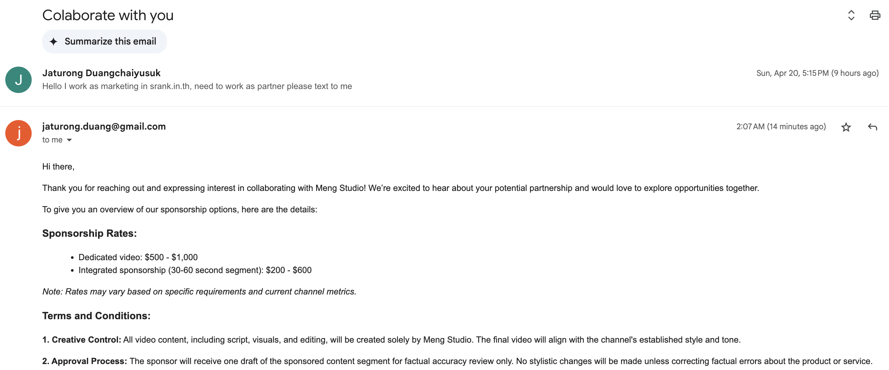

### 07 Multi agent

Multi agent include supervisor agent and email agent

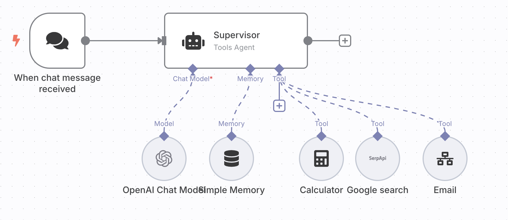
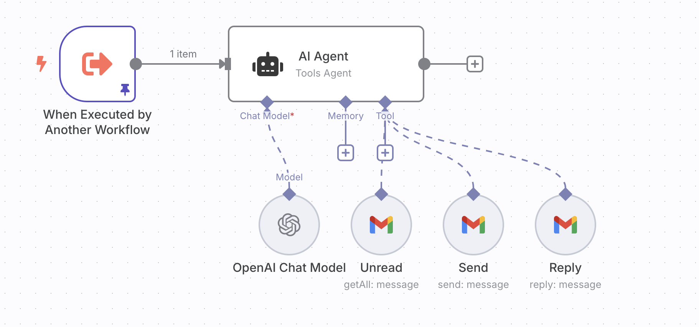

### 08 Form upload to RAG

Browsing document files then update to vector store (RAG)

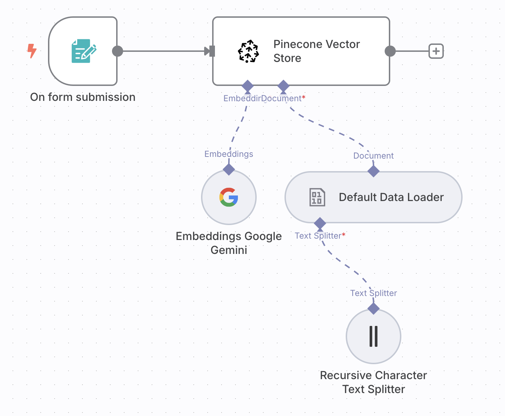
